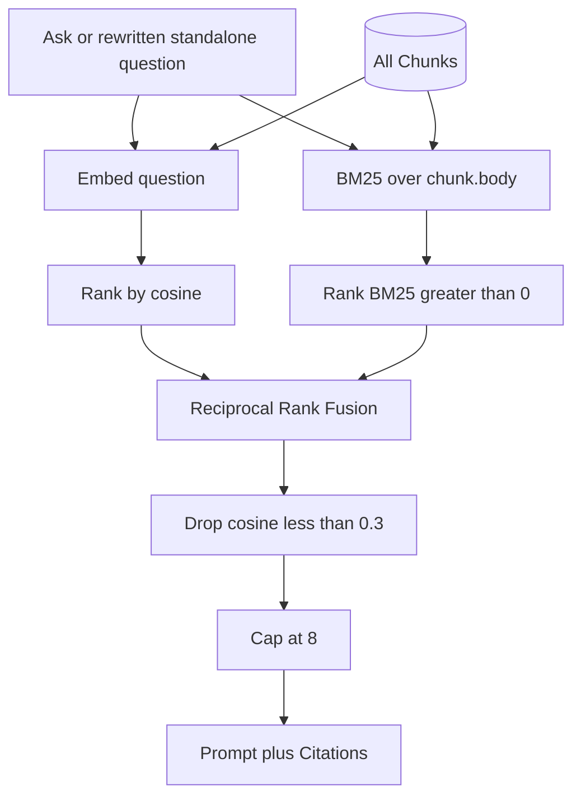

# Rank Chunks with BM25 and cosine, fused, then gated by cosine

Retrieval scores every Chunk two ways — cosine similarity of embeddings, and BM25 over `chunk.body` — then orders them by Reciprocal Rank Fusion. A Chunk that appears on both lists is one result with two rank terms. Cosine `RETRIEVAL_MIN_SIMILARITY` still decides relevance after fusion: below it, a Chunk never reaches the prompt or the Citations. The cap of eight is applied last.

This is infrastructure for learning hybrid retrieval, not a response to a measured miss. At this Corpus size a sequential scan of every Chunk still beats an index, so BM25 lives in the server process, rebuilt when the set of Chunk ids changes, rather than as Postgres full-text or a blob written at ingest.

## Consequences

- A BM25-strong Chunk can rise in the fused order, including one cosine ranked outside today's previous top-eight, but the threshold in ADR-0002 still vetoes an orthogonal match.
- Ingest and the ADR-0003 fingerprint are unchanged. A tokenizer or stopword change takes effect on the next server process, which rebuilds BM25 from stored bodies.
- `RetrievedChunk.similarity` remains cosine, so Citations still rank Pages by cosine rather than by the fused score.
